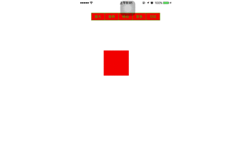

# redBall

### Pods pop
1. vim podfile

<pre>
platform :ios,'8.0'

target "RedBall" do

pod 'pop'

end
</pre>

2. pod install

### 动画

1. 宏定义

<pre>
let TLspin = "spin"
let TLmove = "move"
let TLcolor = "color"
let TLscale = "scale"
</pre>

2. 属性定义

<pre>
    let redBall = UIView(frame: CGRect(x: 100, y: 200, width: 100, height: 100))
    let scale = POPSpringAnimation(propertyNamed:kPOPViewScaleXY)
    let move = POPSpringAnimation(propertyNamed: kPOPLayerPositionY)
    let spin = POPSpringAnimation(propertyNamed: kPOPLayerRotation)
    let color = POPSpringAnimation(propertyNamed: kPOPViewBackgroundColor)
    
</pre>

3. segmentContol创建

        let array = ["放大","旋转","移动","变色","归位"]
        
        let segmentedControl = UISegmentedControl.init(items:array)
        
        segmentedControl.frame = CGRect(x:50,y:50,width:self.view.frame.size.width-100 ,height:30)
        
        segmentedControl.tintColor = UIColor.green
        
        segmentedControl.backgroundColor = UIColor.red
        
        segmentedControl.addTarget(self, action:#selector(segmentedControlChanged(segmented:)), for: UIControlEvents.valueChanged)
        
        self.view .addSubview(segmentedControl);
  
4. 动画代码

     0. pop放大，旋转，移动，变色，还原动画
     1. springBounciness: 弹性振幅，范围0-20
     2. springSpeed: 震动速度
     3. pop_add: 加载动画
 
<pre> 
    func redBallScale()  {
        // 放大动画
        scale?.toValue = NSValue(cgPoint:CGPoint(x: 2, y: 2))
        scale?.springBounciness = 20
        scale?.springSpeed = 1
        redBall.pop_add(scale, forKey: TLscale)
    }
    func redBallSpin()  {
        //旋转动画
        spin?.toValue = Double.pi * 4
        spin?.springBounciness = 20
        spin?.springSpeed = 5
        redBall.layer.pop_add(spin, forKey: TLspin)
        
    }
    func redBallMove()  {
        //y坐标位移动画
        move?.toValue = 500
        move?.springBounciness = 20
        move?.springSpeed = 5
        redBall.layer.pop_add(move, forKey: TLmove)
    }
    func redBallColor()  {
        //背景颜色变化
        color?.toValue = UIColor.green
        color?.springBounciness = 20
        color?.springSpeed = 5
        redBall.pop_add(color, forKey: TLcolor)
        
    }
</pre>
        